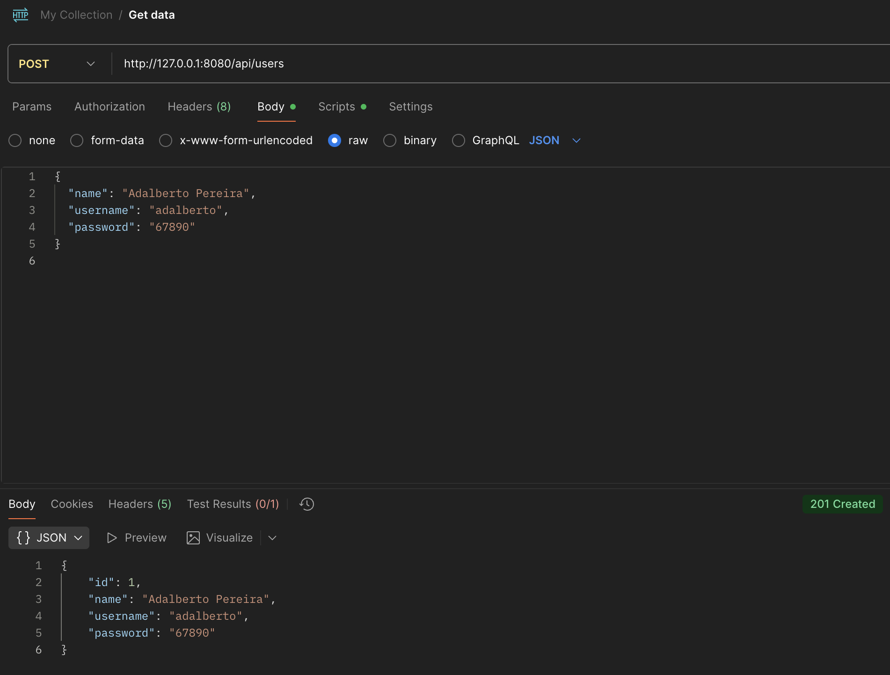
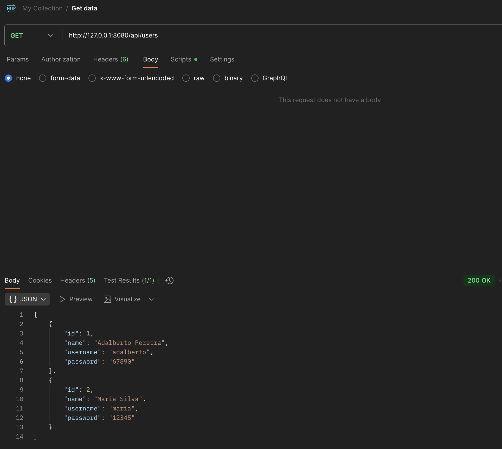
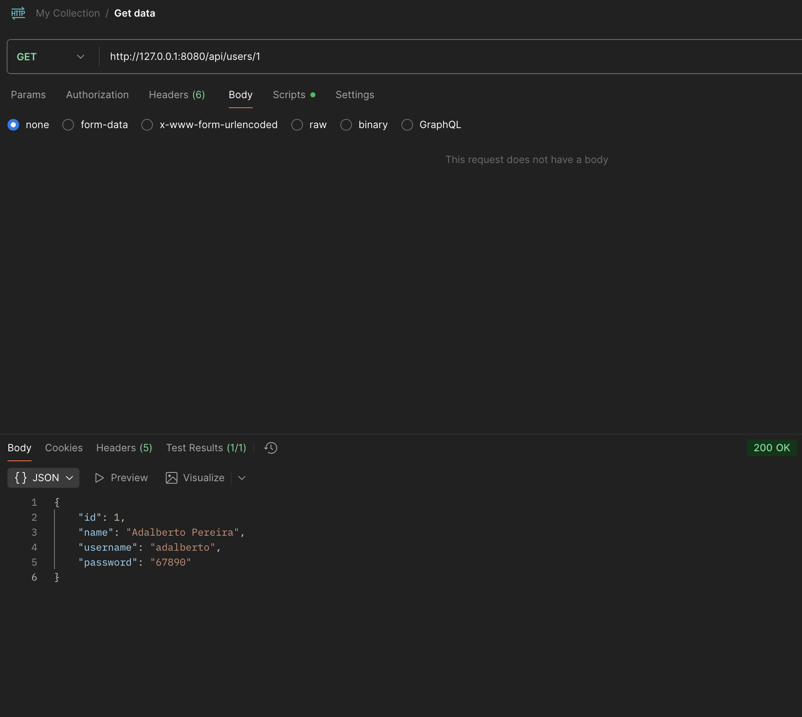
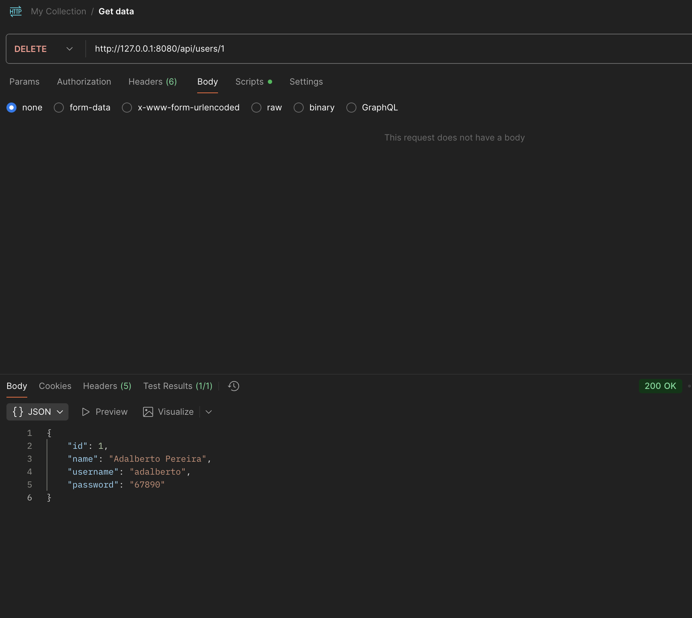
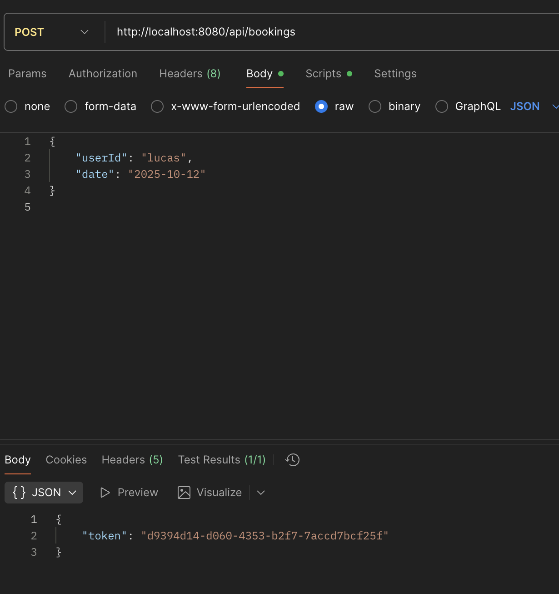
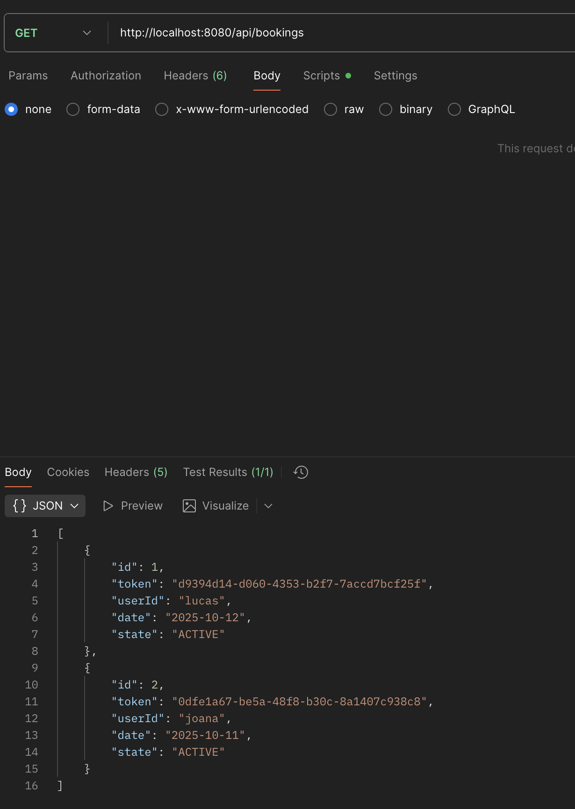
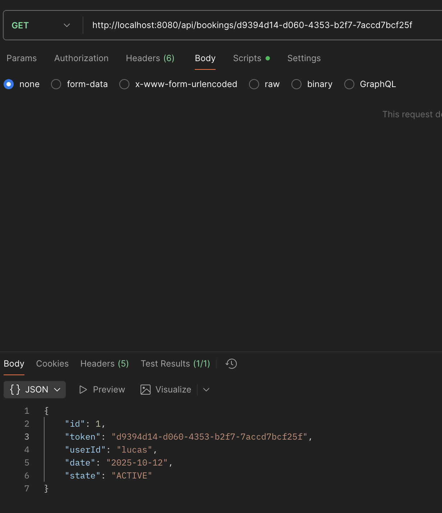
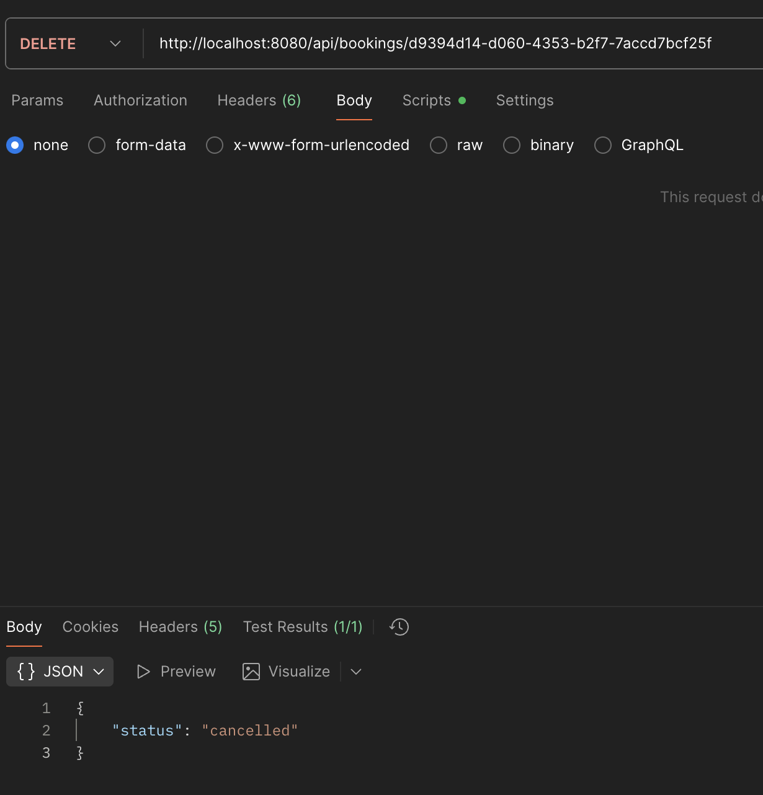
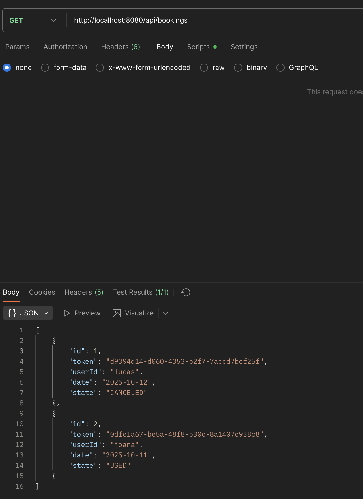

# Ex3.1 - What is Spring Boot?

## O que é uma enterprise application?

Uma aplicação empresarial é um sistema grande e complexo usado por empresas ou instituições para gerir processos críticos — como faturação, logística, recursos humanos ou comunicação entre serviços.
Estas aplicações precisam de ser seguras, escaláveis e fiáveis, suportando muitos utilizadores e dados.

---

## Quais são as principais frameworks Java para aplicações empresariais?

* **Jakarta EE** (antigo Java EE): conjunto de especificações para servidores de aplicações (ex.: WildFly, Payara).
* **Spring Framework**: alternativa mais flexível e modular, com injeção de dependências, MVC, AOP, etc.
* **Spring Boot**: camada acima do Spring que simplifica a configuração e o arranque de projetos.
* **Outros**: **Quarkus**, **Micronaut** e **Helidon**, focados em microserviços e cloud.

---

## Qual é a relação entre Spring, Spring Boot e Jakarta?

* O **Spring Framework** é a base — fornece as ferramentas principais (injeção, beans, MVC).
* O **Spring Boot** usa o Spring e automatiza muita da configuração inicial (dependências, servidor embutido, etc.).
* O **Jakarta EE** fornece APIs padrão (ex.: JPA, Servlet), que o Spring Boot também utiliza.
  Desde o Spring Boot 3, muitas bibliotecas migraram para os pacotes jakarta.* .

---

## Identifica exemplos de configuração automática no Spring Boot.

* Criação automática de um DataSource se existir um driver JDBC.
* Configuração do Hibernate/JPA para entidades e transações.
* Inclusão de um servidor embutido (Tomcat ou Jetty).
* Definição de controladores REST e conversores JSON (Jackson).
* Ativação do Spring Boot Actuator (monitorização e métricas).

---

## Ligação com o meu percurso académico

O **Spring Boot** junta vários temas que já aprendi:

* Programação orientada a objetos e padrões (injeção de dependências).
* Bases de dados e SQL (JPA simplifica o acesso).
* Desenvolvimento web (controladores, HTTP, JSON).
* Arquitetura em camadas e testes.

# Ex3.2

Durante o arranque da aplicação, o Spring Boot mostra várias mensagens no *console log*.
Entre elas, aparecem referências a **Tomcat**, como:

```
Tomcat initialized with port 8080 (http)
Starting service [Tomcat]
Starting Servlet engine: [Apache Tomcat/10.1.18]
Tomcat started on port 8080 (http) with context path ''
```

O **Tomcat** é um servidor de aplicações Java que implementa as especificações Jakarta Servlet, JSP e outras APIs relacionadas com o desenvolvimento web em Java.

* Não é preciso instalar nem configurar um servidor à parte;
* O Tomcat é iniciado automaticamente quando se executa `mvn spring-boot:run`;
* A aplicação fica imediatamente disponível em `http://localhost:8080`.

O Tomcat tua como servidor HTTP que recebe pedidos (*requests*) e envia respostas (*responses*), processa internamente as Servlets e controladores REST definidos na aplicação Spring Boot e facilita o desenvolvimento e testes locais, tornando o *deploy* mais simples e rápido.

# Ex3.3 

## Qual a justificativa para os packages data, services, boundary?

A estrutura segue a arquitetura em camadas com clara separação de responsabilidades:

* **data** — camada de **persistência / modelo**

  Contém as **entidades JPA** e os repositórios (DAO). Responsabilidade: mapear as tabelas e consultar/guardar dados na BD.

* **services** — camada de **negócio / serviço**

  Encapsula regras de negócio, transações e orquestra chamadas ao repositório. Não sabe nada sobre HTTP — apenas opera sobre o domínio (objetos User).

* **boundary** — camada de **interface/comunicação** 

  Expõe a aplicação ao exterior via HTTP. Responsabilidade: receber requisições, validar/parsing, retornar respostas HTTP. Chama services para fazer trabalho real.

Justifictiva:

* **Encapsulamento**: cada camada tem um propósito único; facilita teste, substituição (ex.: trocar JPA por outro mecanismo) e manutenção.
* **Desacoplamento**: controllers dependem de services, services dependem de repositories — dependências unidireccionais (top-down).
* **Testabilidade**: mocks UserService ao testar controllers; mocks UserRepository ao testar services.
* **Segurança & validação**: preocupações como autenticação, validação e transformação ficam em camadas apropriadas (boundary → validação, services → regras).

---

## Qual é a relação entre classes **data.User**, **data.UserRepository**, **services.UserServiceImpl**, **boundary.UserRestController**?

Em termos de dependência:

* `UserRestController` **depende de** `UserService` (injeção).
* `UserServiceImpl` **depende de** `UserRepository`.
* `UserRepository` **opera com** `User` (genérico `JpaRepository<User, Long>`).
* `User` **não depende** das camadas superiores (modelo autónomo).

Em termos de relacionamento:

1. `boundary.UserRestController` (controller REST) recebe uma requisição HTTP.
2. Ele chama `services.UserService` (na prática `UserServiceImpl`) para executar a operação desejada.
3. `UserServiceImpl` usa `data.UserRepository` para consultar/guardar `data.User` na base de dados.
4. `data.User` é a entidade que representa a linha na tabela `users`.

---

## Diagrama UML

-

---

## Postman prints
### Postam-POST
  
### Postam-GET(all)

### Postam-GET(one)

### Postam-DELETE


## O que são as dependências “spring-boot-starter-*”?

Os Spring Boot Starters são coleções pré-configuradas de dependências Maven criadas para simplificar a configuração de projetos Spring.
Os starters (spring-boot-starter-data-jpa, spring-boot-starter-web, spring-boot-starter-validation, spring-boot-starter-thymeleaf, spring-boot-starter-test, etc.) fornecem suporte automático para funcionalidades como APIs REST, persistência de dados, validação e testes, sem necessidade de configuração manual.
Isto promove separação de camadas (data, services e boundary), reduz a complexidade e garante compatibilidade entre versões.

---


|                                                                  | **Module / Component**                                                      |
| ---------------------------------------------------------------- | --------------------------------------------------------------- |
| **Spring framework API to interact with (relational) databases** | **spring-data-jpa** (included via **spring-boot-starter-data-jpa**) |
| **Implementation of the reference Java Persistence API (JPA)**   | **hibernate-core**                                                |
| **Specific database drivers included in this project**           | **com.h2database:h2** and **org.postgresql:postgresql**             |

---

## Onde os Dados estão a ser guardados?

Os dados estão a ser guardados numa **base de dados em memória H2**, que o Spring Boot configura automaticamente. As tabelas (como users) são criadas automaticamente pelo JPA, mas os dados desaparecem quando a aplicação é encerrada.

---

# Ex3.4

## Planeamento

| Camada                    | Classes/Componentes         |
| ------------------------- |-----------------------------|
| **Boundary / Controller** | `MealBookingController`     | 
| **Service**               | `MealsBookingService`       |
| **Data / Repository**     | `MealBookingRepository`,`MealBookingRequest`      |                                

| Endpoint                        | Método HTTP | Descrição                                   |
| ------------------------------- | ----------- | ------------------------------------------- |
| `/api/bookings`                 | POST        | Criar uma nova reserva; retorna token único |
| `/api/bookings`                 | GET         | Listar todas reservas                       |
| `/api/bookings/{token}`         | GET         | Consultar uma reserva específica            |
| `/api/bookings/{token}`  | DELETE        | Cancelar uma reserva                        |
| `/api/bookings/{token}/checkin` | POST        | Fazer check-in (usar o ticket)              |

## Postman prints

### Postam-POST
  
### Postam-GET(all)inicial

### Postam-GET(one)

### Postam-DELETE

### Postam-GET(all)final
